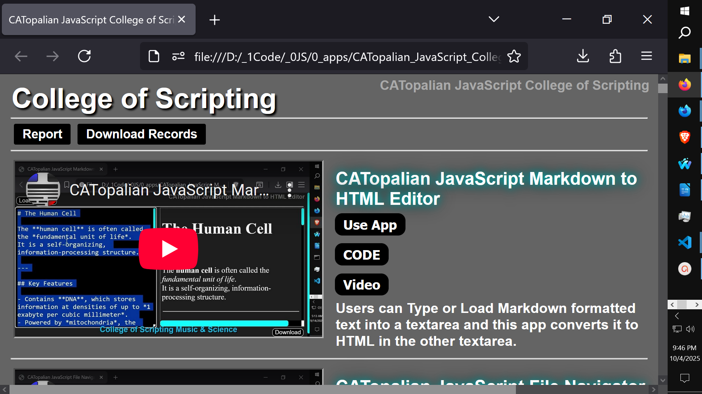
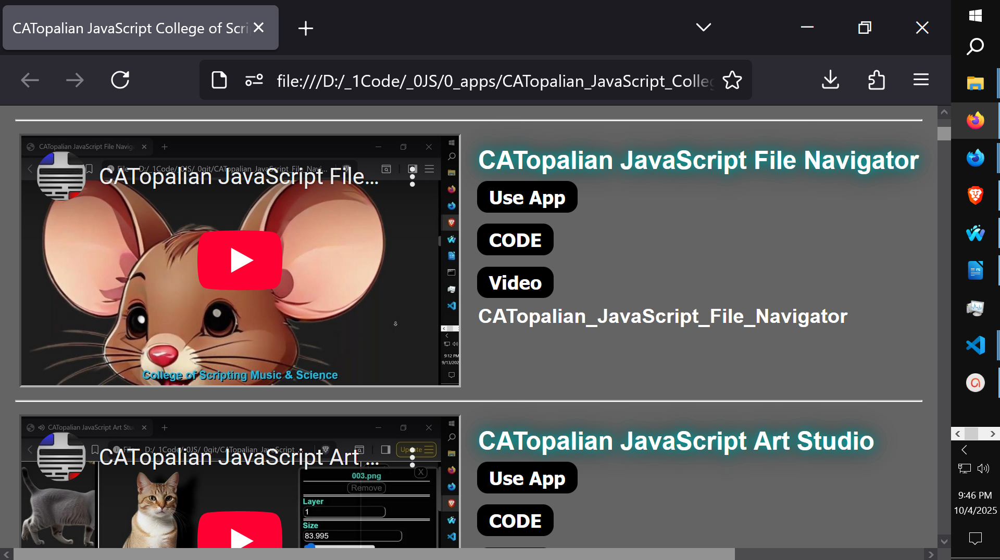
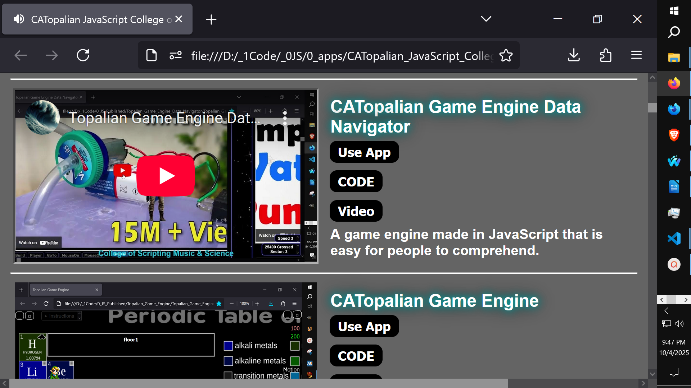

# CATopalian JavaScript College of Scripting
Our JavaScript College of Scripting app displays a database of apps and tutorials and shows their videos, code, and screenshots, from an array of objects in an orderly column.  

---

Video: https://www.youtube.com/watch?v=_wRvEQcMky0

---

---

### How to Download this App
1. Click the green Code Button on this github page
2. Choose Download ZIP
3. Save the Zip File
4. Extract All
5. Double click the HTML file to start the App

---

Happy Scripting :-)

---

//----//  

// Dedicated to God the Father  
// All Rights Reserved Christopher Andrew Topalian Copyright 2000-2025  
// https://github.com/ChristopherTopalian  
// https://github.com/ChristopherAndrewTopalian  
// https://sites.google.com/view/CollegeOfScripting

